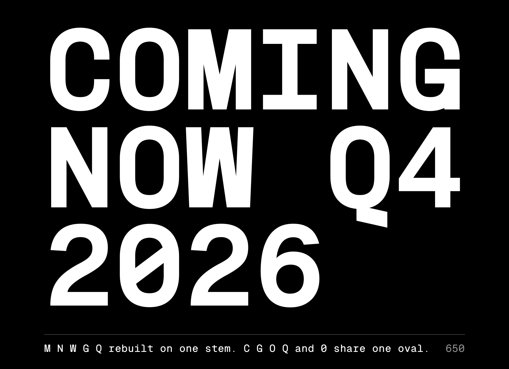
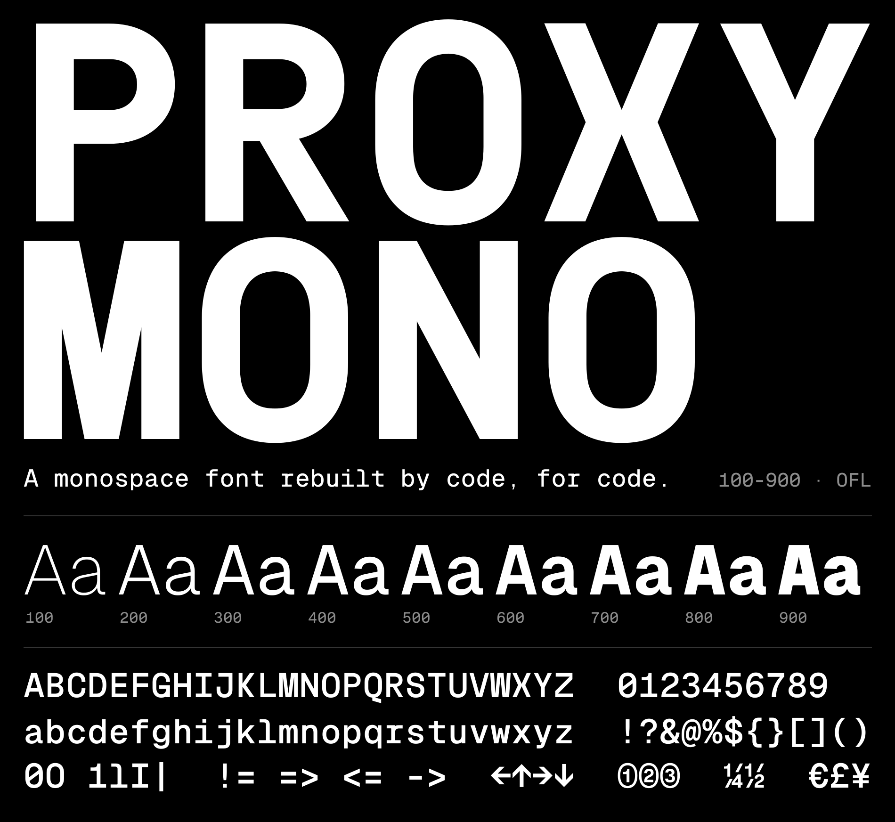
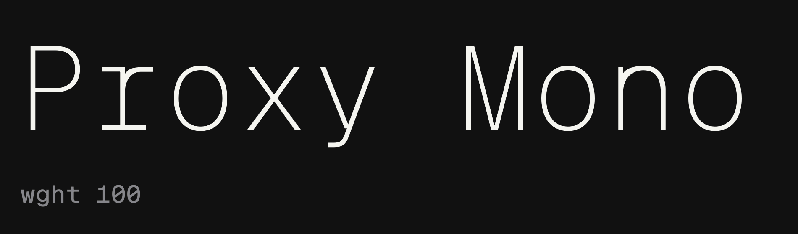
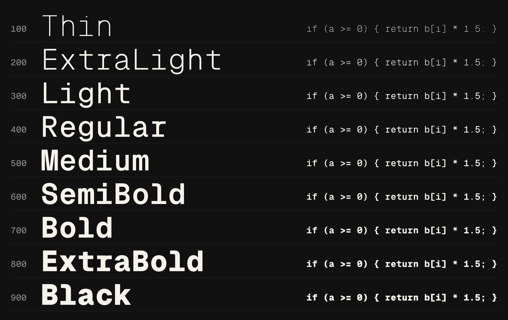
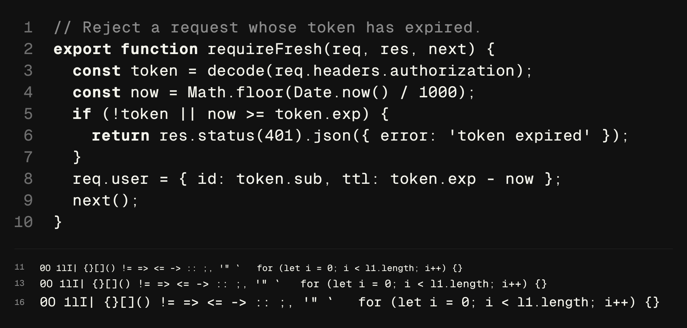
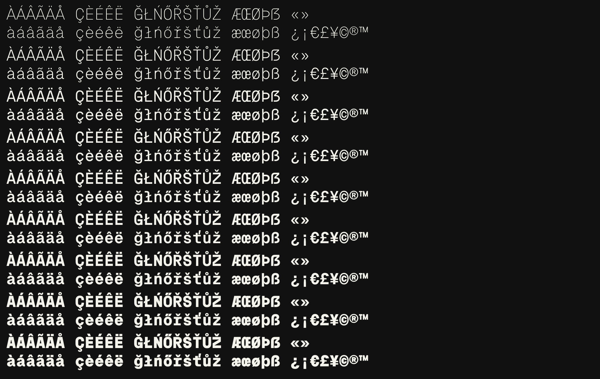

# Proxy Mono

Proxy Mono is a monospaced typeface rebuilt by code, for code: one variable family, Thin (100) to
Black (900), designed by Danny Liang at [monoproxy](https://www.monoproxy.studio). It is made to hold
up as a display heading and still work all the way down to code in an editor.

- **One stem across every glyph.** Every upright carries the same stem at each weight, on straight
  stems and on the sides of the bowls alike: 46 units at Thin, 110 at Regular, 197 at Black. Horizontals
  and arches run thinner so they read as the same weight (at Regular the bar of the H is 103, the top of
  the O 102).
- **M, N, W, G and Q rebuilt.** Every stroke of the M, N and W is one stem and runs the full cap height,
  up to Black. C, G, O, Q and the zero share one oval: flat sides, round ends.
- **No ink traps**, a slashed zero and round descenders.
- **Thin (100) to Black (900) on one cell.** Every character is 700 units wide on a 1000-unit em, cap
  height 800, x-height 600, at all nine weights. None of the fonts it starts from covers that range on
  this cell.

Every number above is measured from the built fonts, not estimated.





Specimen and type tester: https://www.monoproxy.studio/lab/proxymono







## Coverage

611 encoded characters: GF Latin Core and more. Western, Central and Eastern European languages,
Vietnamese, and a wide set of symbols, arrows, currencies and fractions.



## What changed from the upstream fonts

Proxy Mono starts from three open-source monospaces and is rebuilt so that it reads as one design.

| Part | Taken from | What was changed |
|---|---|---|
| Most capitals | Space Mono | Ink traps removed; M, N and W rebuilt so every stroke is one stem and runs the full cap height; Q rebuilt as the O with a tail |
| B, D, J, K, P, R and the Q's tail | Martian Mono | Refitted to the 700-unit cell and the shared stem |
| The zero | Built from the O | The O with a slash |
| G | Built from the C | The C's bowl with a bar and a stem |
| Lowercase, figures, punctuation and the capital Y | Geist Mono | Interpolated to the shared stem at each weight; accented letters composed; every glyph centred in its cell |

## Download

The latest fonts are in [`fonts/`](fonts): `variable/` for the variable font, `ttf/` for the nine static
weights, `webfonts/` for the web.

`slant/` holds the same family with a second axis, slant 0 to 10° (an oblique, not a drawn italic). It is
not part of the Google Fonts submission, which is weight only.

## Building

The fonts are generated by a Python script, not drawn in a font editor. `sources/generator/az.py`
builds each weight from the upstream open-source fonts in `sources/upstream/`: it interpolates their
masters to the target stem, rebuilds the letters listed above, removes ink traps, composes the
accented letters and centres every glyph in its cell.

```
make build   # fonts/variable, fonts/ttf and fonts/webfonts
make test    # fontspector, Google Fonts profile
```

Python 3.12. `make build` creates the virtualenv from `requirements.txt`; `sh sources/build.sh` does the
same in one command.

## Sources

- `sources/generator/`: the scripts that build the fonts. This is the source to edit.
- `sources/upstream/`: the open-source fonts they start from. Space Mono as UFOs, Martian Mono and
  Geist Mono as published.
- `sources/masters/`: the nine masters as UFOs with a designspace, exactly as they go into the variable
  font, so the outlines can be opened in a font editor. They are written on every build.

## Quality assurance

Every build runs [fontspector](https://github.com/fonttools/fontspector) with the Google Fonts profile.
Current result: 0 failures, 3 warnings.

- `vendor_id`: MNPX is not yet registered with Microsoft.
- `unreachable_subsetting`: the combining marks belong to no Google Fonts subset, but the
  language-shaping checks for Czech, Danish and Vietnamese fail without them, so they stay.
- `contour_count`: one symbol (⓿) has a different contour count from the reference fonts.

## Upstream

Proxy Mono is a derivative of these SIL Open Font License fonts. Their notices are kept in
[OFL.txt](OFL.txt) and [AUTHORS.txt](AUTHORS.txt):

- Space Mono: Copyright 2016 The Space Mono Project Authors
- Martian Mono: Copyright 2021 The Martian Mono Project Authors
- Geist Mono: Copyright 2023 Vercel, in collaboration with basement.studio

## License

This Font Software is licensed under the SIL Open Font License, Version 1.1. See [OFL.txt](OFL.txt),
also available with a FAQ at https://openfontlicense.org
